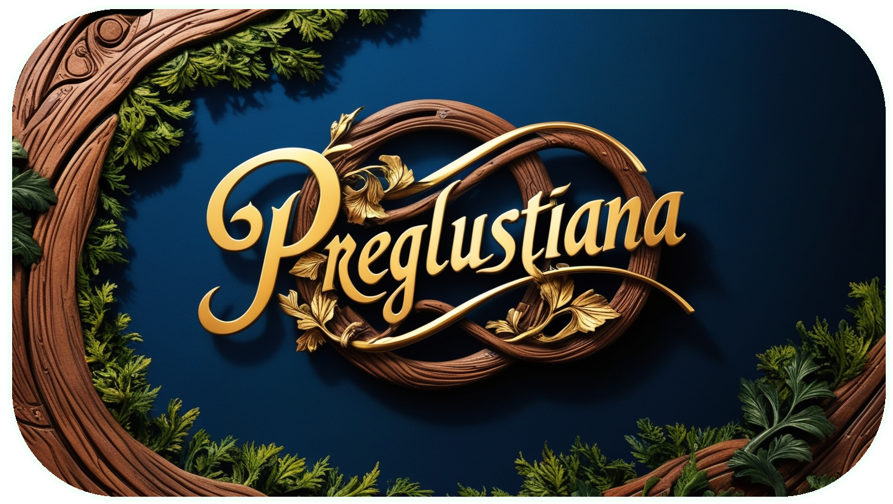

<h1 align="center"><ins>Preglustiana 🌐</ins></h1>

Le Preglustiana est une langue fictive, inventée par KFCgaming. 👤

Elle a commencé à être crée le 14 Juillet 2024. 📆

Elle forme un mélange du Français, de l'Anglais et de l'Espagnol. D'ailleur, l'accent donné à cette langue est l'accent Espagnol. 🪇

Cependant, la traduction de la langue du Français au Preglustiana s'est fait mot par mot. 📜</in>

Il se pourrait donc qu'un vrai dictionnaire fait son apparition pour bien traduire les mots et non mot par mot. 📖

Cette langue est pour l'instant construite par une seule personne mais pourrait finir par être collaborative. 👥

 
<h2>Qu'est ce <i>repository</i> ? 🤔</h2>

Ce <i>repository</i> a été conçu initialement pour pouvoir mettre tout utilisateur à la même version de la langue. ⬆️

Mais, cette fonction est donc devenue un <i>repository</i> pour pouvoir tester cette langue. ✅

Pour l'instant, vous ne pouvez uniquement utilisé cette langue grâce à un programme en Python. 📥

 Dans un future très proche, j'envisagerai de faire une version HTML afin que quiconque peut l'utilisé. 🤗

<h2>Comment utiliser le programme Python ?🐍</h2>

Plusieurs choses sont requises pour pouvoir tester la langue. Voici la liste :

<ul><li>Python <a href="https://www.python.org/downloads/">(Lien Vers Site)</a></li><li>Requests (Windows : pip install requests | Linux : sudo pip3 install colorama)</li><li>Colorama (Windows : pip install colorama | Linux : sudo pip3 install colorama)</li></ul>

Une fois les installations requises, vous pouvez lancer le Programme. ▶️

Vous arriverez sur un menu avec 3 choix. Pour le moment, vous pourrez uniquement faire le troisième choix car il vous manque le fichier dictionnaire. ❌

Vous devrez donc tapez "3" pour ainsi télécharger le Dictionnaire. Une fois cela fait, vous pouvez utilisé le programme. 📥

 

La première option traduit les phrases du Français au Preglustiana. <ins>Exemple :</ins> Je vis. ➡ Ye vidami.

La seconde option traduit les phrases au Preglustiana au Français.  <ins>Exemple : </ins> Ele havano un manzomma ➡ Elle a une pomme.

<h2>Le programme ne fonctionne plus après avoir installer le dictionnaire 🫤</h2>

Ne vous en faite pas, ce n'est rien. Il est juste fort probable qu'une virgule a été oublié dans le fichier du dictionnaire.

Pour ce faire, rendez vous à cet emplacement `C:\Users\{Nom_d'utilisateur}\AppData\Roaming\KFCgaming\PregluFrench` et vous y trouverez ce fichier "DictionnaryPSFR.json" .

Ouvrez le afin de l'éditer. Vous devez faire attention à ce que chaque ligne finisse par une virgule sauf la dernière. Si vous trouvez une ligne sans virgule à la fin hormis la dernière, vous devez en mettre une pour que le programme refonctionne.

Si votre programme ne fonctionne toujours pas, vous devrez regardé la formation du programme.

<ins>Exemple :</ins>  "je" : "ye",

Cette formation se décrit comme ceci : Un espace avant les premiers caractères, traduction Française entre guillemets, deux points, traduction Preglustianaise entre guillemets et une virgule sauf si c'est la dernière ligne.

Si votre programme ne fonctionne encore pas, je suis navré mais je n'ai plus aucunes options pour vous aidez...

